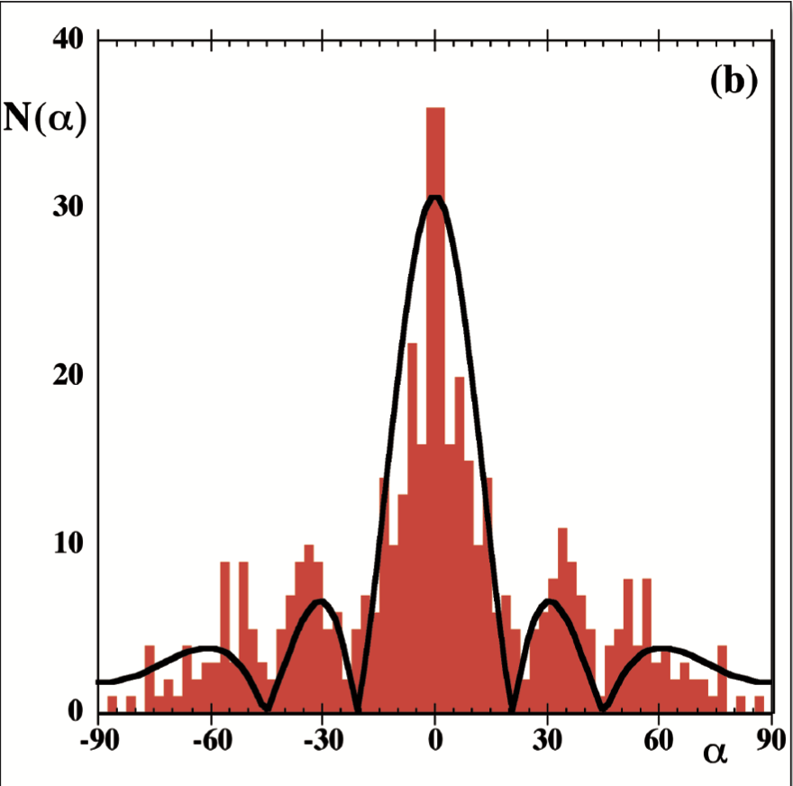
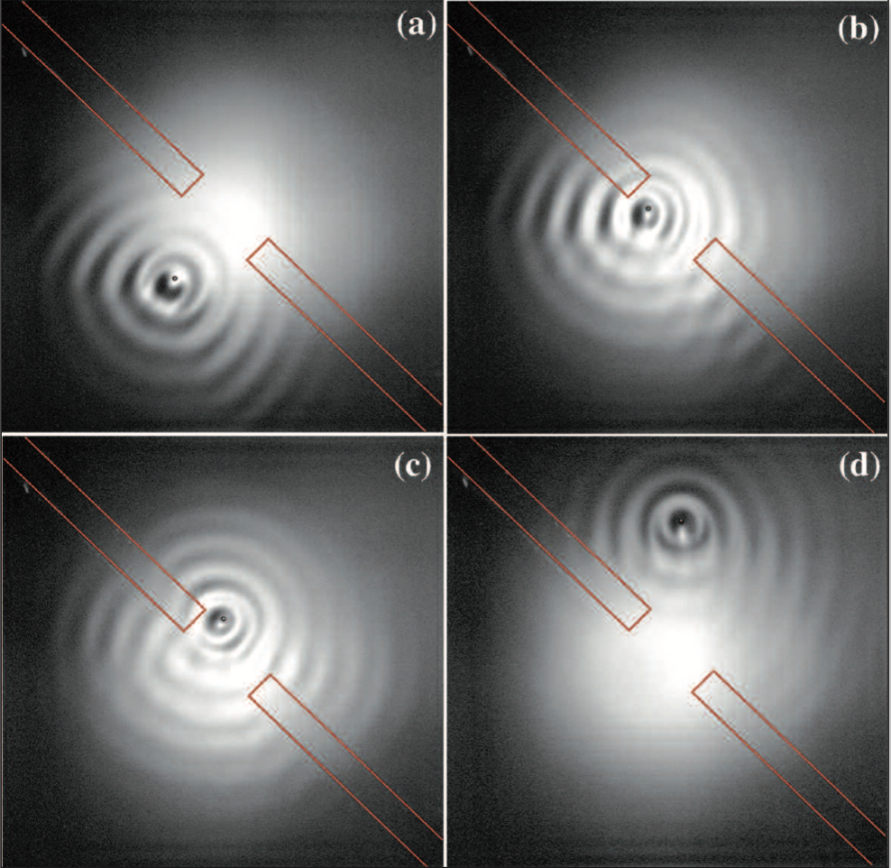

# Walker Drops and Pilot-Wave Dynamics

**Authors:** Jeimy Alejandra Alarcón, Santiago Rodriguez Feijoo, Diego Alejandro Herrera Rojas.

**Summary:** Although wave-particle duality appeared in the twentieth century in the context of Quantum Mechanics, a classical system exhibiting interesting properties commonly associated to De Broglie's pilot-wave dynamics. As summarised by Couder, Boudaoud, Protière & Fort (2010), a droplet bouncing on a bath of the same liquid shows remarkable quantum-like features. More recently, on the world famous International Physics Tournament, an interesting quest directed towards exploring the limits of the quantum-like properties of a bouncing liquid droplet, or *walker*, has been set. In the present state-of-art document, some of the main advances in the study of this particular system are presented. In addition to that, a tentative problem question is presented. The aim of this document is to illustrate the framework of the area in which the course project is to be developed during the rest of the semester.

## Introduction

In general, a droplet bouncing on the surface of a liquid bath of the same composition coalesces with it rapidly, in tenths of a second. However, this coalescence can be avoided by vibrating the bath with a vertical acceleration amplitude that exceeds that of gravity (Couder, Boudaud, Protière, 2010). In this regime, a thin layer of air prevents droplet-liquid bath recombination. Experiments performed with silicon oil (20 times more viscous than water) demonstrate that when the acceleration amplitude exceeds a critical value, the so called *Faraday instability* occurs, and the open surface of the liquid bath is prone to weakly damped oscillations. Coupling of the droplet bouncing motion and its induced Faraday waves on the bath surface leads to a *walker* behaviour, in which the droplet seems to advance in a straight line with constant velocity.

As demonstrated in scientific works in the first two decades of twenty-first century, the properties of this *walker* droplet and its associated Faraday wave resemble quite remarkably properties commonly associated to quantum particles. For instance, Couder, Boudaoud, Protière & Fort (2010), showed that dispersion of *walkers* from single and double slit barriers is described by statistics very similar to those of single electrons. The wavelength of induced Faraday waves playing a role akin to the De Broglie wavelength. Even more striking, Bush (2015) has shown that a walker trapped inside corral, has a statistical description in terms of the amplitude of its coupled Faraday wave. The probability of finding the *walker* inside a given point of the corral is proportional to the amplitude of its wave. Moreover, phenomena such as tunnelling from barrier and orbital motion in rotating frames have also been studied by Bush (2015) both from a theoretical and experimental perspective.

  
  
    Statistics of <i>walker</i> dispersion by single slit barrier (Couder, Boudaud, Protière, 2010).

(**Some paragraph on IPT question might be written**)

After discussing some of the experimental work carried out in the study of *walker* dynamics, focusing on parameter ranges for their existence, first principle models based on Navier -Stokes equations are introduced. Results from numerical simulations demonstrating quantum corral confinement and tunnelling from a barrier are presented. Finally, a discussion on the possible project questions, algorithms to be used for simulations and expected results is carried out.

(**May need to complement on the nature of the models and simulations**)

## Experimental Work

## Theoretical Work

## Numerical Simulations

## References

* Bush J. W. M. (n. d.). *Hydrodynamic Quantum Analogs*. Retrieved from https://math.mit.edu/~bush/?page_id=484.

* Bush J. W. M. (2015). *Pilot-Wave Hydrodynamics*. Annu. Rev. Fluid Mech., 47(1). 269 - 292. doi: [10.1146/annurev-fluid-010814-014506](http://math.mit.edu/~bush/wordpress/wp-content/uploads/2015/01/Bush-AnnRev2015.pdf). (**Alejandra**)

* Milewski A. P., Galeano-Rios C. A., Nachbin A., & Bush J. W. M. (2015). *Faraday Pilot-Wave Dynamics: Modelling and Computation*. J. Fluid Mech., 778(1). 361 - 338. doi: [10.1017/jfm.2015.386](http://math.mit.edu/~bush/wordpress/wp-content/uploads/2015/09/Milewski-JFM.pdf). (**Diego**)

* Oza A. U., Rosales R., Bush J. W. M. (2013). *A Trajectory Equation for Walking Droplets: Hydrodynamic Pilot Wave Theory*. J. Fluid. Mech., 737(1). 552 - 570. doi: [10.1017/jfm.2013.581](https://math.mit.edu/~bush/?p=2492). (**Sebastian**)

* Couder Y., Boudaoud A., Protière S., & Fort. E. (2010). *Walking Droplets. A Form of Wave-Particle Duality at Macroscopic Scale?*. Europhysics News, 14(1). 14 - 18. doi: https://doi.org/10.1051/epn/2010101. (**Diego**)

* Couder Y., Fort E., Gautier C. H., Boudaoud A. (2005). *From Bouncing to Floating: Noncoalescence of Drops on a Fluid Bath*. Phys. Rev. Lett., 94(1). 177801 1-4. doi: [10.1103/PhysRevLett.94.177801](https://journals.aps.org/prl/abstract/10.1103/PhysRevLett.94.177801). (**Alejandra**)

* Couder Y., Protière S., Fort E., & Boudaoud A. (2005). *Walking and Orbiting Droplets*. Nature, 437(1). 208. doi: https://doi.org/10.1038/437208a. (**Sebastian**)
